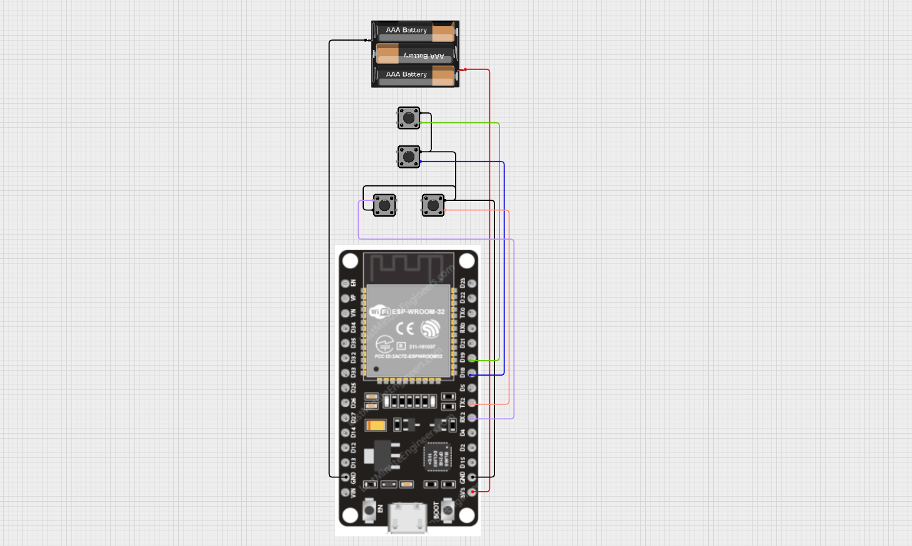

# MicroPython BLE HID Keyboard Controller

This project turns an ESP32-S2 (or similar MicroPython-capable board with BLE support) into a **Bluetooth HID Keyboard**.  
Five input pins are monitored and mapped to various keyboard actions such as:

- Arrow keys  
- `Ctrl + t`  
- Sending characters  
- Sending strings

The device advertises itself as a standard BLE keyboard and works with Windows, macOS, Linux, Android, and iOS.

---

## ✨ Features
- BLE HID Keyboard using the `hid_services` library  
- Five GPIO-triggered key actions  
- Functions for single keys, shifted keys, and full string typing  
- Automatic advertising + reconnection  
- Example-friendly class design

---

## 🛠 Hardware Setup

| Pin | Action |
|-----|--------|
| GPIO 19 | Forward key → HID `0x4F` (Right Arrow) |
| GPIO 18 | Backward key → HID `0x50` (Left Arrow) |
| GPIO 17 | Second tab → `Ctrl + Tab` |
| GPIO 16 | First tab → `Ctrl + Shift + Tab` |
| GPIO 0  | "S" key |

All pins use **Pin.PULL_UP**, so each switch should short the pin to **GND** when pressed.

---

## 📦 Requirements

### MicroPython firmware with BLE support  
ESP32-S2 / ESP32-S3 recommended.
# Instalation instructions
- Copy one of the hid_services library into your lib directory (hid_services.mpy is recomended)
  
# working example


```python
import time
from machine import Pin
from hid_services import Keyboard

class Device:
    def __init__(self, name="Keyboard"):
        # --- CONFIG TABLE (edit this to change buttons) ---
        self.actions = [
            # pin,        keycode, modifier
            (19, 0x4F, None),              # Forward → Right Arrow
            (18, 0x50, None),              # Backward → Left Arrow
            (17, 0x1F, "ctrl"),            # Ctrl + 2
            (16, 0x1E, "ctrl"),            # Ctrl + 1
            (0,  0x16, None),              # Key "S"
        ]
        # --------------------------------------------------

        # Load pins dynamically
        self.pins = []
        for pin_num, keycode, modifier in self.actions:
            self.pins.append(Pin(pin_num, Pin.IN, Pin.PULL_UP))

        # Create Bluetooth keyboard
        self.keyboard = Keyboard(name)
        self.keyboard.set_state_change_callback(self.keyboard_state_callback)
        self.keyboard.start()

    # BLE state changes (unused but required)
    def keyboard_state_callback(self):
        pass

    def advertise(self):
        self.keyboard.start_advertising()

    def stop_advertise(self):
        self.keyboard.stop_advertising()

    def release_keys(self):
        self.keyboard.set_keys()
        self.keyboard.set_modifiers()
        self.keyboard.notify_hid_report()

    def send(self, keycode, modifier):
        # Apply modifiers
        if modifier == "ctrl":
            self.keyboard.set_modifiers(left_control=1)
        elif modifier == "shift":
            self.keyboard.set_modifiers(left_shift=1)
        elif modifier == "ctrl-shift":
            self.keyboard.set_modifiers(left_control=1, left_shift=1)
        else:
            self.keyboard.set_modifiers()

        # Send key
        self.keyboard.set_keys(keycode)
        self.keyboard.notify_hid_report()
        time.sleep_ms(5)

        # Release
        self.release_keys()
        time.sleep_ms(200)

    # MAIN LOOP
    def start(self):
        self.advertise()
        while True:
            if self.keyboard.get_state() == Keyboard.DEVICE_CONNECTED:
                for i, (pin_num, keycode, modifier) in enumerate(self.actions):
                    if not self.pins[i].value():  
                        self.send(keycode, modifier)
            else:
                time.sleep(2)
d = Device()
d.start()


```

# ⌨️ Full HID Keyboard Key Code List

Below is a complete list of HID keyboard scan codes (0x00–0xE7).  
These can be used with:

```python
self.set_key(HID_CODE)
self.keyboard.set_modifiers(left_shift=1, left_control=1)
```

# A–Z (Letters)

| Key | Code | Key | Code |
|-----|------|-----|------|
| A   | 0x04 | N   | 0x11 |
| B   | 0x05 | O   | 0x12 |
| C   | 0x06 | P   | 0x13 |
| D   | 0x07 | Q   | 0x14 |
| E   | 0x08 | R   | 0x15 |
| F   | 0x09 | S   | 0x16 |
| G   | 0x0A | T   | 0x17 |
| H   | 0x0B | U   | 0x18 |
| I   | 0x0C | V   | 0x19 |
| J   | 0x0D | W   | 0x1A |
| K   | 0x0E | X   | 0x1B |
| L   | 0x0F | Y   | 0x1C |
| M   | 0x10 | Z   | 0x1D |

# Numbers (Top Row)

| Key | HID Code |
|-----|----------|
| 1   | 0x1E     |
| 2   | 0x1F     |
| 3   | 0x20     |
| 4   | 0x21     |
| 5   | 0x22     |
| 6   | 0x23     |
| 7   | 0x24     |
| 8   | 0x25     |
| 9   | 0x26     |
| 0   | 0x27     |

# Control Keys

| Key       | HID Code |
|-----------|----------|
| Enter     | 0x28     |
| Escape    | 0x29     |
| Backspace | 0x2A     |
| Tab       | 0x2B     |
| Space     | 0x2C     |

# Symbols

| Key | HID Code |
|-----|----------|
| -   | 0x2D     |
| =   | 0x2E     |
| [   | 0x2F     |
| ]   | 0x30     |
| \   | 0x31     |
| ;   | 0x33     |
| '   | 0x34     |
| `   | 0x35     |
| ,   | 0x36     |
| .   | 0x37     |
| /   | 0x38     |

# Function Keys

| Key | Code | Key | Code |
|-----|------|-----|------|
| F1  | 0x3A | F7  | 0x40 |
| F2  | 0x3B | F8  | 0x41 |
| F3  | 0x3C | F9  | 0x42 |
| F4  | 0x3D | F10 | 0x43 |
| F5  | 0x3E | F11 | 0x44 |
| F6  | 0x3F | F12 | 0x45 |

# Navigation Keys

| Key          | HID Code |
|--------------|----------|
| Insert       | 0x49     |
| Home         | 0x4A     |
| Page Up      | 0x4B     |
| Delete       | 0x4C     |
| End          | 0x4D     |
| Page Down    | 0x4E     |
| Right Arrow  | 0x4F     |
| Left Arrow   | 0x50     |
| Down Arrow   | 0x51     |
| Up Arrow     | 0x52     |

# Modifiers

## Modifiers are set using:

```python
self.keyboard.set_modifiers(left_control=1, left_shift=1)
# Modifiers
```
| Modifier       | Bit  |
|----------------|------|
| Left Control   | 0x01 |
| Left Shift     | 0x02 |
| Left Alt       | 0x04 |
| Left GUI (Win) | 0x08 |
| Right Control  | 0x10 |
| Right Shift    | 0x20 |
| Right Alt      | 0x40 |
| Right GUI      | 0x80 |

# Numpad Keys

| Key      | HID Code |
|----------|----------|
| NumLock  | 0x53     |
| /        | 0x54     |
| *        | 0x55     |
| -        | 0x56     |
| +        | 0x57     |
| Enter    | 0x58     |
| 1        | 0x59     |
| 2        | 0x5A     |
| 3        | 0x5B     |
| 4        | 0x5C     |
| 5        | 0x5D     |
| 6        | 0x5E     |
| 7        | 0x5F     |
| 8        | 0x60     |
| 9        | 0x61     |
| 0        | 0x62     |
| .        | 0x63     |
